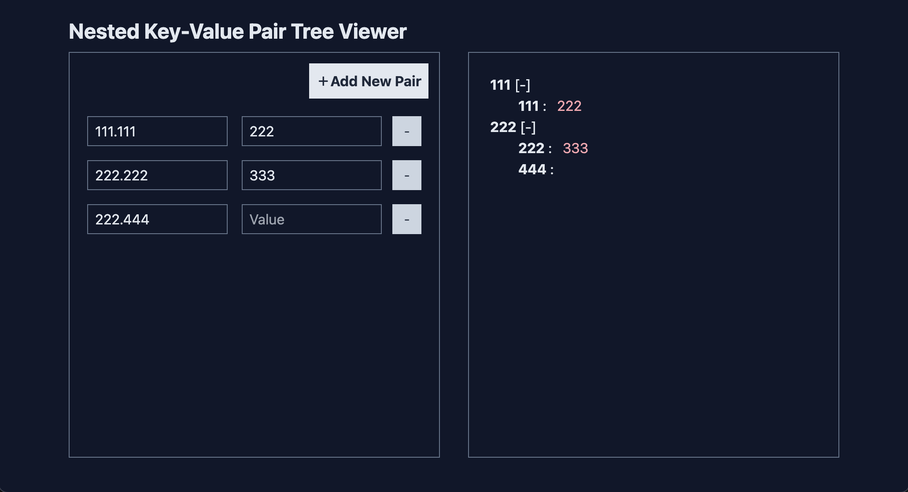

## Nested-tree-demo



### 🚀 專案啟動

1. 安裝所需 node_modules

```bash
$ npm i
```

2. 啟動

```bash
$ npm run dev
```

### 遇到的問題 :

#### 1. 需定義轉換後的資料格式來使用遞迴組件進行樹狀結構渲染

#### 解決方法：

> #### - 因為使用樹狀結構需要使用陣列來遍歷，所以定義資料為陣列物件型態，先定義如下
>
> ```typescript
> interface TreeStructure [{
>    name?: string, // 渲染中組件的 Node 名稱
>    value?: string | null, // 渲染組件中的 Leaf 名稱，可為空null
>    isOpen?: boolean // 控制 Node 可以進行開合關閉
>    child?: [] | Array<TreeStructure> // 如果不止一個節點，就將同樣的結構放進去往下渲染
> }]
> ```
>
> #### - 定義完之後為實作資料結構的演算法，以下將以 _pseudocode_ 進行簡單的說明：
>
> 1.  遍歷所有 input 組成的 Obj 陣列`[{key:'' ,value: ''}]`，並先宣告根節點`result = []`
> 1.  遍歷時將所有輸入的 key 使用`.`分割成陣列型態
> 1.  定義一個當前指標元素指向根節點，遍歷 `key` 陣列檢查指標內有沒有存在 `key`
> 1.  沒有 `key` 的話就建立一個節點`node`給定預設值，並加入當前根節點`result`
> 1.  將指標指向新加入的節點內的`child`
> 1.  有 `key` 的話就指向該節點的`child`
> 1.  如果遍歷到了 `Key` 陣列的最後一個 length， 代表為末節點`Leaf`，加入`value`
> 1.  遍歷完回傳 `result` 即可得到結果
>
> #### - 將資料結構傳進遞迴組件裡面去渲染成樹狀結構。
>
> 1.  渲染第一層結構並將 obj 的`child`當成 props 傳進當前引入的組件(自己)進行階層渲染。

### 2. 階層結構的第一層進行關閉時會關閉所有渲染出來的第一層。

#### 解決方法：

> 研究後發現不能透過單純的`v-if`來做條件判斷開關，必須在原有的結構新增屬性`isOpen`來進行控制
