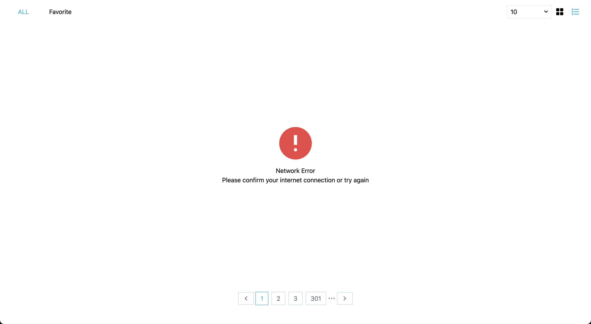
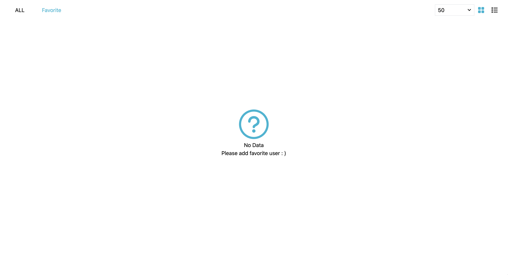

## Random-user


### 專案網頁連結

-   [Random-user](https://random-user-21ee3.web.app/#/)

---

### 🚀 專案啟動

1. 安裝所需 node_modules

```bash
$ npm i
```

2. 啟動

```bash
$ npm run dev
```

---

### 遇到的問題 :

#### 1. 需定義資料的初始值與在重新整理時能保留頁面狀態

#### 解決方法：

> 1.先整理需要留存的資料有哪些：
>
> ```typeScript
>    page: number // 當前所在的頁碼
>    userCount: number // 當前所選顯示用戶的筆數
>    displayMode: string // 當前顯示模式
>    favoriteUser: Array // 喜歡的用戶列表
> ```
>
> -   定義完資料資料之後，將 page 使用`route.query.page`存於網址中，重新整理可以透過網址再次獲取當前頁數。
>     另外的資料因爲不需要長期保留，因此選用`sessionstorage`進行保留，在重新整理後進行資料的獲取即可維持頁面狀態。
>
> 2.定義資料流：
>
> -   當頁面掛載時先確認`sessionstorage`有沒有暫存資料，如沒有資料就給定預設值，並將資料打入 `Pinia` 全域的狀態管理，方便各個組件取用。
>
> ```TypeScript
>    function initSetting() {
>        const previousSetting = sessionStorage.getItem('pageSetting' || 'null');
>        if (previousSetting !== null) {
>            getPreviousSetting(previousSetting); // 有資料就使用上一個設定
>        } else {
>            setDefaultSetting(); // 沒有資料就進行使用預設值
>        }
>    }
> ```
>
> -   監聽頁面的設定有變動的話就再次存入`Pinia`，讓各個組件的組件的值能同步更新

#### 2. 資料筆數為 3010 時，如果使用固定好的值 call API 將導致最後一頁資料數不正確

#### 解決方法：

> -   修正資料獲取的方法
>
> ```TypeScript
> function getCurrentPageUserCount() {
>    const totalResults = 3010; //總筆數
>    const resultsPerPage = $storePageSize.value; // 當前頁面一次顯示幾個User
>    const totalPages = Math.ceil(totalResults / resultsPerPage); // 算出總頁數
>    const lastPageResults = totalResults - (totalPages - 1) * resultsPerPage; // 算出最後一頁的筆數應該為幾個
>    const lastPage = currentPage.value === totalPages ? lastPageResults : resultsPerPage; // 下一頁如果到底的話就使用剛剛得到得 lastPageResults
>    return lastPage;
> }
>
> // call API 參數`params.results` 傳入 getCurrentPageUserCount()解決問題
> const res = await fetch(`${BASEURL}?page=${params.page}&results=${params.results}&seed=TEST`);
> ```

#### 3. API 有時候會連線錯誤，或是資料為空白時，將會影響使用者體驗

#### 解決方法：

> -   加入網路錯誤提示
>     
> -   資料為空白時加入新增"Favorite user 提示"
>     
